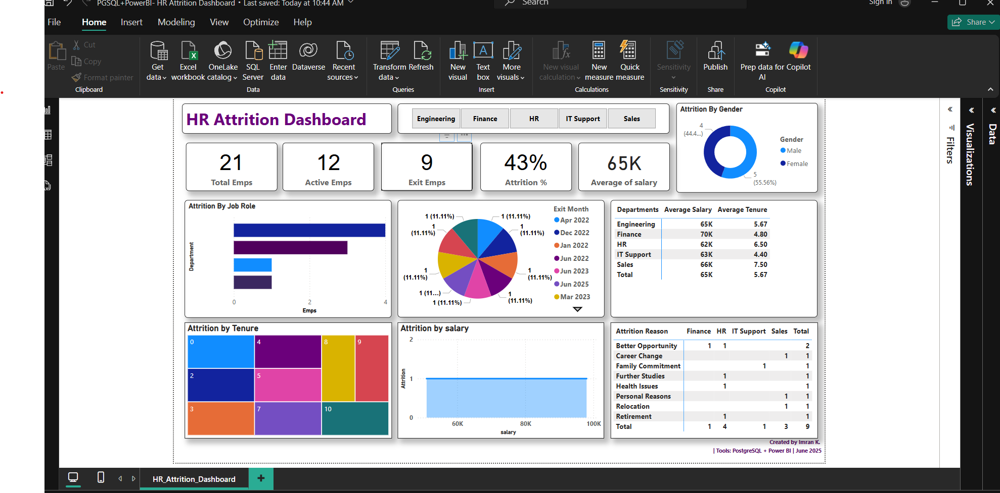

# HR Attrition Dashboard – Power BI + PostgreSQL

**Tools Used:** Power BI, PostgreSQL

## Description:
This project analyzes employee attrition using Power BI connected to a PostgreSQL database. It tracks:
- Monthly attrition %
- Salary bands
- Department-wise exits and net gain
- Tenure-based analysis

## How to Use:
- Download the `.pbix` file above
- Open it in Power BI Desktop
- If needed, relink to your local database or explore visuals directly

## Screenshots:

## Business Use:
Helps HR teams monitor attrition trends, identify problem areas, and make data-driven retention decisions.
